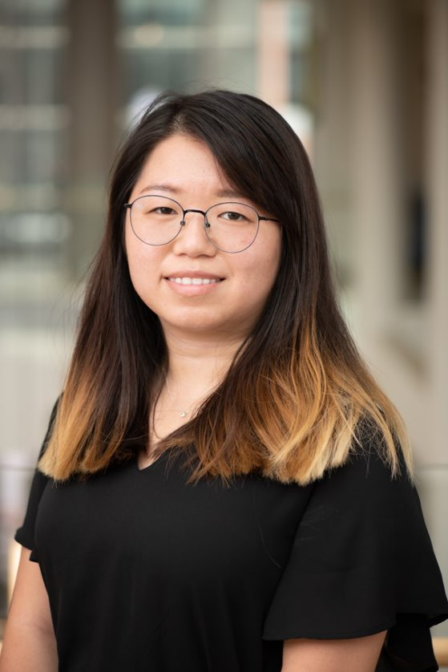
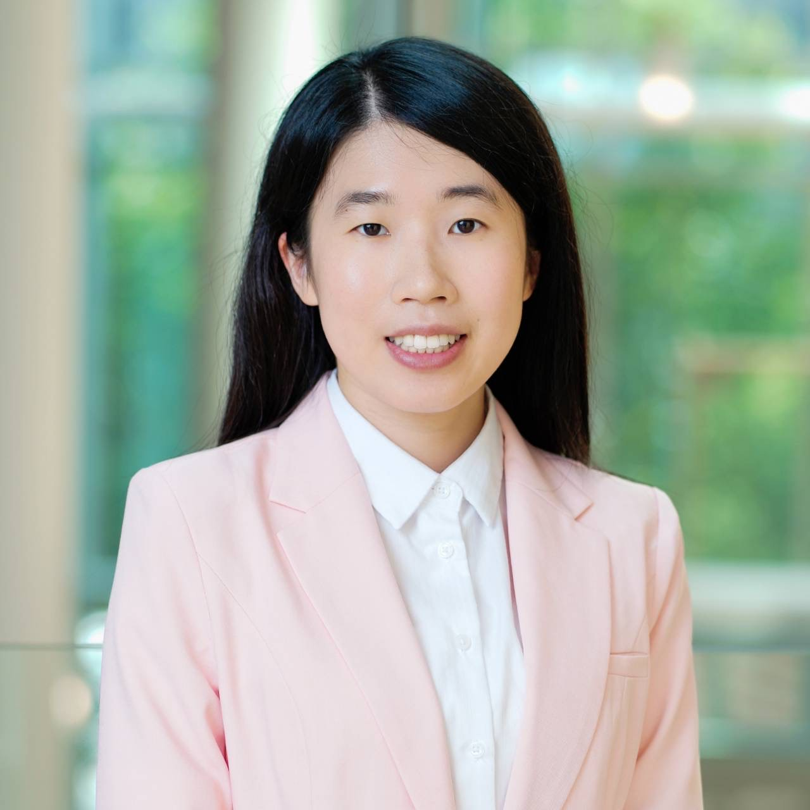
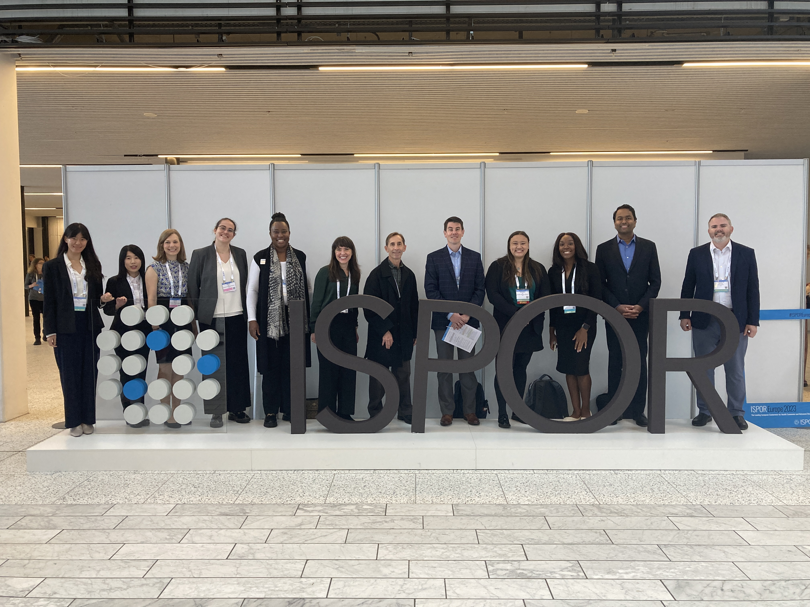

```{r setup, include=FALSE}
knitr::opts_chunk$set(echo = TRUE)

# Load necessary libraries
library(readr)
library(knitr)
library(DT)

# Read and display the CSV file as a table
UMB_ISPOR_Awards <- read_csv("files/UMB_ISPOR_Awards.csv")
UMB_ISPOR_Publications <- read_csv("files/UMB_ISPOR_Publications.csv")
```

```{css, echo=FALSE}
body, h1, h2, h3, h4, h5, h6 {
  font-family: Helvetica;
}
h1 {
  font-weight: bold;
  color:#01ABE4;
  font-size: 28px;
}
h2 {
  font-weight: bold;
  font-size: 24px;
}
h3 {
  font-size: 20px;
}
body {
  font-size: 16px;
  line-height: 2; 
  margin-top: 16px;
}

/* Button */

.button {
  background-color: #01ABE4;
  border: none;
  color: white;
  padding: 8px 16px;
  text-align: center;
  text-decoration: none;
  display: inline-block;
  font-size: 16px;
  border-radius: 8px;
}


/* Table */
.custom-table {
  width: 100%;
  border-collapse: collapse;
}
.custom-table td {
  padding: 10px;
  border: 1px solid #ddd;
  text-align: left;
}
.custom-table .col1 {
  width: 30%;
  vertical-align: center;
}
.custom-table .col2 {
  width: 70%;
  vertical-align: top;
}


/* Card */
.card-container {
    display: grid;
    grid-template-columns: repeat(2, 1fr);
}
.card {
    background-color: #ffffff;
    border: 1px solid #e0e0e0;
    border-radius: 8px;
    padding: 20px;
    margin: 10px;
    /* Add more styles as needed */
}
.card-image {
    width: 100%; 
    border-top-left-radius: 8px;
    border-top-right-radius: 8px;
}
.card-title {
    font-size: 20px;
    margin-top: 20px;
    color:#01ABE4;
}
.card-description {
    font-size: 16px;
    line-height: 2; 
    color: #555;
}


/* Gallery */
div.gallery-container {
  display: flex;
  flex-wrap: wrap;
  justify-content: space-between;
  width: 100%; /* Ensures the gallery fits the full width of the page */
  box-sizing: border-box;
}
/* Each gallery item */
div.gallery {
  margin: 5px;
  border: 1px solid #ccc;
  width: calc(33.3333% - 10px); /* 3 items per row, accounting for margin */
  box-sizing: border-box;
}

div.gallery:hover {
  border: 1px solid #777;
}
/* Images within the gallery */
div.gallery img {
  width: 100%;
  height: auto;
  display: block;
  object-fit: cover;
  aspect-ratio: 4/3;
}

/* Description */
div.desc {
  padding: 15px;
  text-align: center;
}


```

{width="100%"}

# ISPOR and ISPOR Student Network

## What is ISPOR

The **International Society for Pharmacoeconomics and Outcomes Research** is the leading professional society for **health economics and outcomes research (HEOR)** globally.

Founded in 1995, the Society's mission is to promote HEOR excellence to improve decision making for health globally. With more than 20,000 individual and regional chapter members representing over 115 countries, ISPOR is the leading source for scientific conferences, peer-reviewed and MEDLINE-indexed publications, good practices guidance, education, collaboration, and tools/resources in the field.

ISPOR focuses on 5 core pillars designed to improve the science, education, and global engagement of its members and the HEOR community.

1.  Scientific and Research Excellence
2.  Member Engagement
3.  Education and Training
4.  Communication and Collaboration
5.  Organizational Values

## ISPOR Student Network

All ISPOR members who are students belong to the Student Network---an engaged collection of PhD, masters, PharmD, and other HEOR-related disciplines. With 1000+ individual members and 2000 chapter members from around the world, the Student Network represents more than 70 countries.

The Network's students are united by similar interests and passion for excellence in research. Most student members belong to a local chapter based at, or near, their university. Currently there are more than 140 ISPOR Student Chapters representing 30+ countries.

The ISPOR Student Network also provides for leadership opportunities in the form of volunteer roles: student network chair, 4 student committees, 3 regional leads, and the student internship/fellowship subcommittee of the Faculty Advisor Council's Professional Development Focus Group.

# UMB ISPOR Student Chapter

## Who are we?

{width="100%"} INSERT TEXT. INSERT TEXT. INSERT TEXT. INSERT TEXT. INSERT TEXT. INSERT TEXT. INSERT TEXT. INSERT TEXT. INSERT TEXT. INSERT TEXT. INSERT TEXT. INSERT TEXT. INSERT TEXT. INSERT TEXT. INSERT TEXT. INSERT TEXT. INSERT TEXT.

## What do we do?

::: card-container
::: card
::: card-image

:::

<h3 class="card-title">

Educational Events

</h3>

::: card-description
Journal clubs, Coding workshops
:::
:::

::: card


<h3 class="card-title">

Campus Involvement

</h3>

::: card-description
Fall Fest,Global Kick-off
:::
:::

::: card
::: card-image

:::

<h3 class="card-title">

Networking Opportunities

</h3>

::: card-description
Quiz competition, Alumni luncheon
:::
:::

::: card
::: card-image

:::

<h3 class="card-title">

Career Developments

</h3>

::: card-description
Career panel, P&T competition
:::
:::
:::

## Subscribe our newsletter

Never miss out on our latest events! [**Subscribe**](https://mailchi.mp/21d3bd3376a7/subscribe-umb-ispor) to our notifications and be the first to know whenever we're hosting something exciting. Whether it's workshops, webinars, or special gatherings, you'll always stay in the loop. Don't forget to subscribe here to receive regular updates and stay connected with everything happening in our community! Interested in what we've done in the past? Click [**here**](https://us21.campaign-archive.com/home/?u=07e19669d1799f30f0d96d8cd&id=3eb9f43469) to explore previous issues of our newsletter, packed with valuable insights and updates.

<a href="https://us21.campaign-archive.com/home/?u=07e19669d1799f30f0d96d8cd&id=3eb9f43469"><button class="button">Past Issues</button></a> <a href="https://mailchi.mp/21d3bd3376a7/subscribe-umb-ispor"><button class="button">Subscribe Here</button></a>

## 2023-2024 Executive Board

<table class="custom-table">
  <tr>
    <td class="col1">{width="100%"} </td>
    <td class="col2"> **President** | Lynn (Pei-Lin) Huang </br> Lynn Huang earned her Master of Health Science degree in Health Economics and Outcomes Research from Johns Hopkins University. She also obtained a Bachelor's degree in Nutrition and Health Science from Taipei Medical University. Prior to entering the PHSR program, she worked as a data analyst at the University of Florida and as a Marketing Specialist at EMD Serono (Taiwan). Her research interest focuses on health disparities among individuals with cancer.
    </td>
    </tr>
  <tr>
  <tr>
    <td class="col1">{width="100%"} </td>
    <td class="col2"> **President-elect**| Hyung-Seok (John) Kim </br> Hello, you can call me John! I'm a 2nd year PhD student in the pharmacoeconomics track broadly interested in modeling and value assessment, especially in the realm of Alzheimer's disease. I've lived in Seoul, Singapore, Indonesia, and the US and can say without a doubt, that Indonesian food reigns supreme. I love lifting weights, playing the violin, and have a healthy but not so healthy obsession with karaoke. It's an absolute pleasure connecting with other peers in HEOR. and I can't wait to deepen my and our chapter's relationships with all of you reading this! 
    </td>
    </tr>
  <tr>
  <tr>
    <td class="col1">{width="100%"} </td>
    <td class="col2"> **Secretary** | Yu-Hua Fu </br> Yu-Hua is a second-year PhD student in Pharmaceutical Health Services Research at the University of Maryland, Baltimore. She holds a PharmD and a master's degree in Clinical Pharmacy from National Taiwan University, with experience in regulatory agencies, pharmaceutical companies, and clinical pharmacy practice. Now in her second year as a Peter Lamy pre-doctoral fellow, she focuses on drug safety and geriatric care. Her research interests include implementation research to improve healthcare efficiency, affordability, and equity. She previously served as Alumni and Public Relations Chair for UMB's ISPOR student chapter and will start her role as Secretary this year.
    </td>
    </tr>
  <tr>
  <tr>
    <td class="col1">{width="100%"}  </td>
    <td class="col2"> **Treasurer** | Jenny Contreras </br> Jenny Contreras is the Patient-Centric Value Assessment Pre-doctoral Fellow for Takeda and a PhD Candidate at the University of Maryland School of Pharmacy. She holds a BS in Public Affairs from the University of Texas at Dallas and an MPH in Health Services Organization from the University of Texas Health Science Center in Houston. Before her fellowship, Jenny interned with AstraZeneca's Oncology Outcomes Research group and worked as a Research Coordinator at both the University of Texas Health Science Center and MD Anderson, gaining extensive experience in patient-centered research. Her research interest is measuring shared decision making in oncology.
    </td>
    </tr>
  <tr>
  <tr>
    <td class="col1">{width="100%"} </td>
    <td class="col2"> **PharmD engagement chair** | Nikhil Reddy </br> Nikhil is a second-year PharmD doctoral candidate at the University of Maryland, Baltimore. After graduating from the University of Maryland, College Park with a degree in Neurobiology and Physiology, Nikhil decided to pursue a doctoral degree in pharmacy in hope of gaining insight into the intricacies of healthcare, pharmaceuticals, and patient care. In addition to ISPOR, Nikhil participates as a member in organizations such as IPhO, AMCP, and PDC as well as research projects for the UMSOP faculty. After graduation Nikhil hopes to pursue a fellowship within the pharmaceutical industry. 
    </td>
    </tr>
  <tr>
  <tr>
    <td class="col1"> {width="100%"} </td>
    <td class="col2"> **Alumni and public relations chair** | Chia-yun Hsu </br> Chia-Yun is a fourth-year PhD student in PHSR. As a former Secretary on the UMB ISPOR Student Chapter E-Board, she plans to build on the connections she has made with HEOR experts, alumni, and peers from other universities. In her new role as Alumni and Public Relations Chair, Chia-Yun aims to deepen these relationships through targeted media channels and personalized outreach. Stay tuned for her upcoming announcements about the exciting events that the UMB ISPOR Student Chapter will be hosting in the coming year!
    </td>
    </tr>
  <tr>
  <tr>
    <td class="col1">{width="100%"} </td>
    <td class="col2"> **Faculty advisor** | Julia Slejko, PhD </br> Dr. Slejko's research interests include applied health economic modeling, real-world health economics and outcomes research, and patient-informed value assessment. She holds a BA in Molecular, Cellular and Developmental Biology from the University of Colorado Boulder. Her PhD training at the University of Colorado School of Pharmacy Center for Pharmaceutical Outcomes Research was focused on pharmacoeconomics. Her postdoctoral training was completed at the Pharmaceutical Outcomes Research and Policy Program in the University of Washington School of Pharmacy. Prior to her PhD training, she had a seven-year career in drug discovery at Array BioPharma in Boulder, CO. Dr. Slejko is very active in ISPOR---The Professional Society for Health Economics and Outcomes Research, where she serves as co-lead of ISPOR's Women in HEOR initiative, Co-Chair of the ISPOR Faculty Advisor Council and is a member of ISPOR's Health Science Policy Council.
    </td>
    </tr>
  <tr>
</table>

# Student Achievements and Publications

## Students Network Chapter Award

```{r}
datatable(UMB_ISPOR_Awards)
```

## Student Publications

```{r}
datatable(UMB_ISPOR_Publications)
```

# Gallery

<div class="gallery-container">

<div class="gallery">
  <a target="_blank" href="gallery/1.jpg">  </a>
  <div class="desc"> 2023-2024 E-board </div>
</div>

<div class="gallery">
  <a target="_blank" href="gallery/2.jpg">  </a>
  <div class="desc"> 2023-2024 E-board </div>
</div>

<div class="gallery">
  <a target="_blank" href="gallery/3.jpg">  </a>
  <div class="desc"> 2023 Fall Fest </div>
</div>

<div class="gallery">
  <a target="_blank" href="gallery/4.jpg">  </a>
  <div class="desc"> 2023 Fall Fest </div>
</div>

<div class="gallery">
  <a target="_blank" href="gallery/5.jpg">  </a>
  <div class="desc"> 2023 Fall Fest </div>
</div>

<div class="gallery">
  <a target="_blank" href="gallery/6.jpg">  </a>
  <div class="desc"> 2024 ISPOR x AMCP Trivia Night </div>
</div>

<div class="gallery">
  <a target="_blank" href="gallery/7.jpg">  </a>
  <div class="desc"> 2024 ISPOR x AMCP Trivia Night </div>
</div>

<div class="gallery">
  <a target="_blank" href="gallery/8.jpg">  </a>
  <div class="desc"> 2024 ISPOR x AMCP Trivia Night </div>
</div>

<div class="gallery">
  <a target="_blank" href="gallery/9.png">  </a>
  <div class="desc"> 2023 ISPOR Europe </div>
</div>

<div class="gallery">
  <a target="_blank" href="gallery/10.jpg">  </a>
  <div class="desc"> 2024 ISPOR Alumni Luncheon </div>
</div>

<div class="gallery">
  <a target="_blank" href="gallery/11.jpg">  </a>
  <div class="desc"> 2024 ISPOR Alumni Luncheon</div>
</div>

<div class="gallery">
  <a target="_blank" href="gallery/12.jpg">  </a>
  <div class="desc"> 2024 ISPOR </div>
</div>


</div>


# Follow Us

-   [X (Twitter)](https://x.com/UMB_ISPOR)

-   [LinkedIn](https://www.linkedin.com/groups/14360028/)

-   [Newsletter](https://mailchi.mp/21d3bd3376a7/subscribe-umb-ispor)

-   [E-mail](mailto:umbispor@gmail.com)
