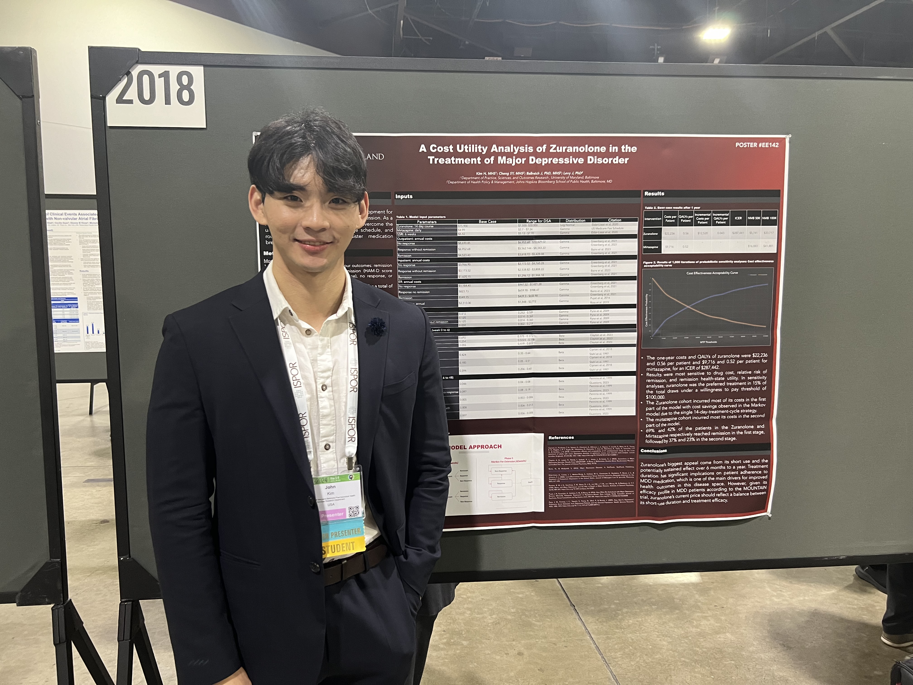
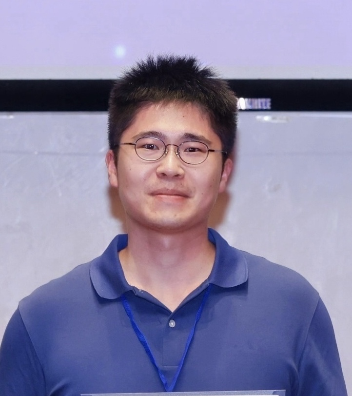
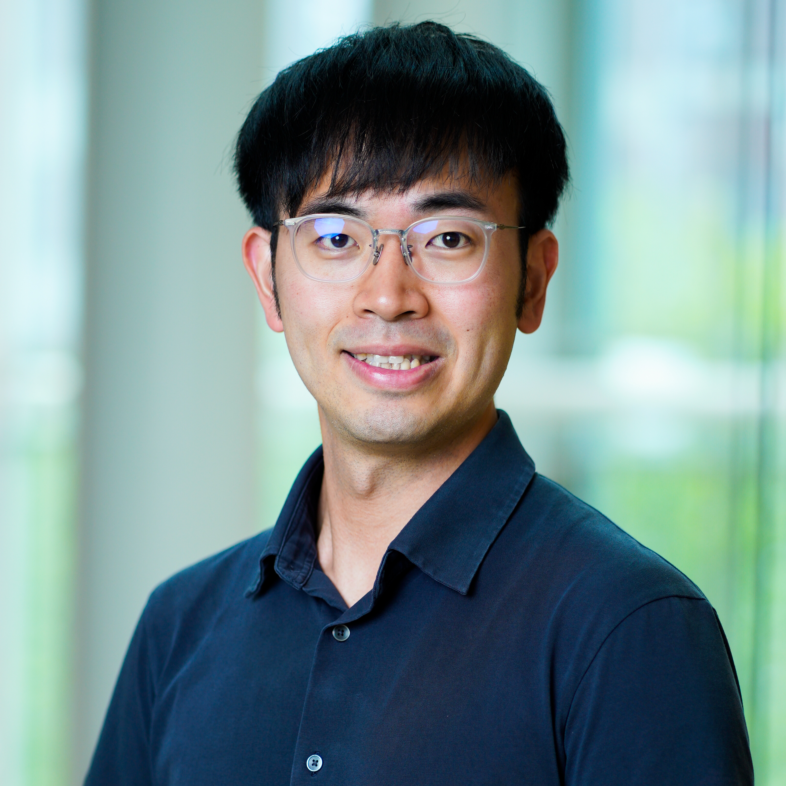
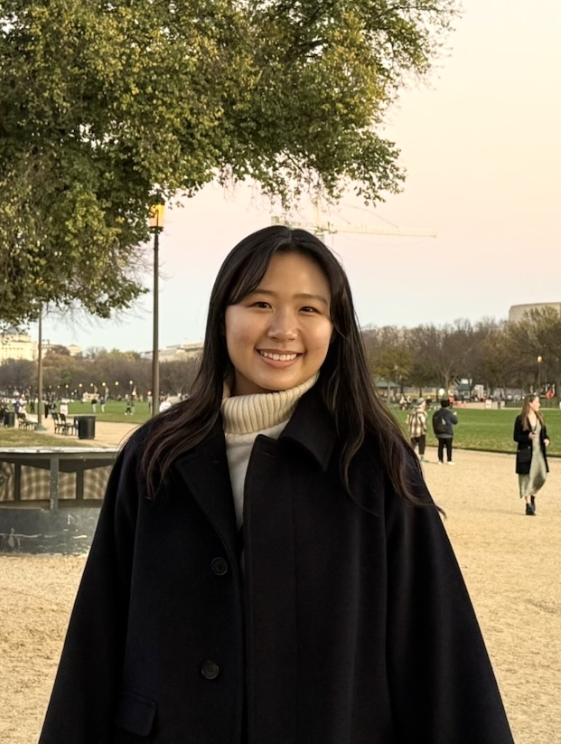
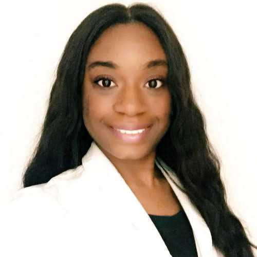
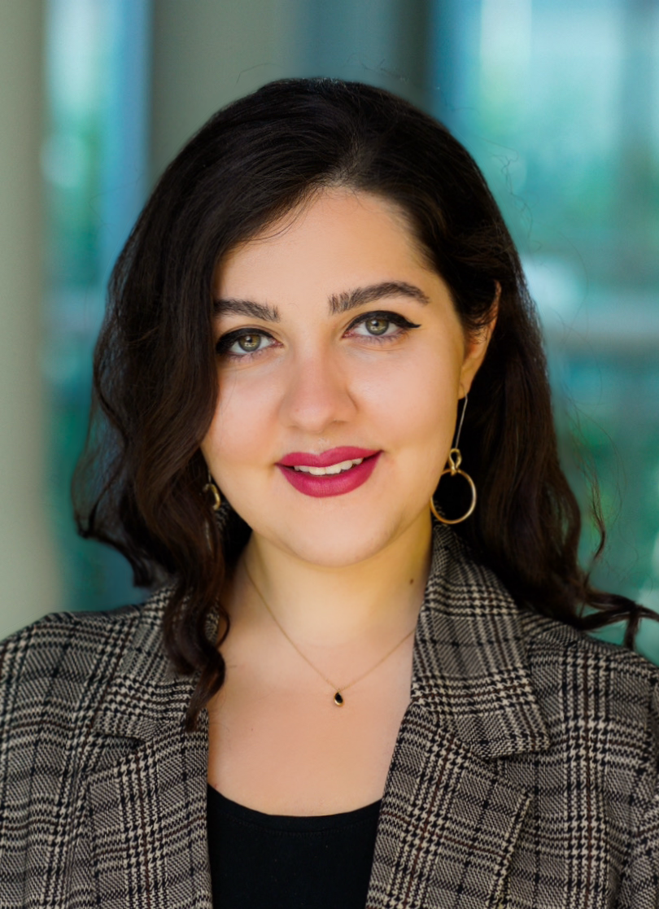
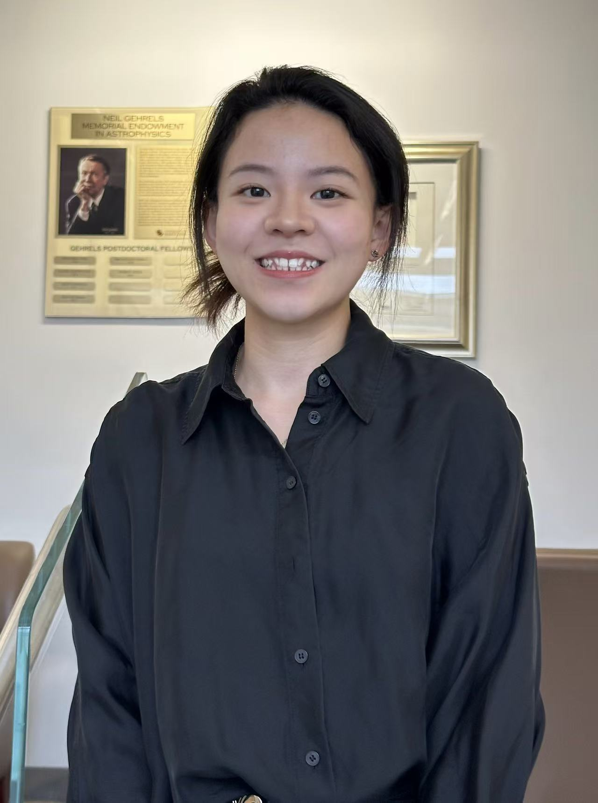

```{r setup, include=FALSE}
knitr::opts_chunk$set(echo = TRUE)
# Load necessary libraries
library(readr)
library(knitr)
library(DT)
library(dplyr)

```

# 2024-2025 Executive Board

<table class="custom-table">
  <tr>
    <td class="col1">{width="100%"} </td>
    <td class="col2"> **President** | Hyung-Seok (John) Kim </br> Hello, you can call me John! I'm a 2nd year PhD student in the pharmacoeconomics track broadly interested in modeling and value assessment, especially in the realm of Alzheimer's disease. I've lived in Seoul, Singapore, Indonesia, and the US and can say without a doubt, that Indonesian food reigns supreme. I love lifting weights, playing the violin, and have a healthy but not so healthy obsession with karaoke. It's an absolute pleasure connecting with other peers in HEOR. and I can't wait to deepen my and our chapter's relationships with all of you reading this! .
    </td>
    </tr>
  <tr>
  <tr>
    <td class="col1">{width="100%"} </td>
    <td class="col2"> **President-elect** | Xujun Gu </br> Xujun Gu is a second-year PhD student in Pharmaceutical Health Services Research at the University of Maryland, Baltimore. He obtained his BSc (Hons) in Economics from University of Nottingham and MSPH in International Health from Johns Hopkins Bloomberg School of Public Health. His interests is in application of AI/ML in HEOR and utilization of real-world evidence in answering affordability and equity questions.
    </td>
    </tr>
  <tr>
  <tr>
    <td class="col1">{width="100%"} </td>
    <td class="col2"> **Secretary** | Yi-Ru (Leo) Chen </br> Leo is a first-year PhD student in Pharmaceutical Health Services Research at the University of Maryland School of Pharmacy. He holds a PharmD from National Cheng Kung University and an MS in Health Outcomes, Policy & Economics, as well as an additional certificate in Applied Biostatistics from Rutgers University. His research focuses on the economic evaluation, safety, and effectiveness of therapies in cardio-oncology and neurodegenerative disorders. During his free time, Leo enjoys playing tennis, basketball, and badminton.
    </td>
    </tr>
  <tr>
  <tr>
    <td class="col1">{width="100%"}  </td>
    <td class="col2"> **Treasurer** | Sungeun Jo </br> Hi all! I'm Sungeun, a 2nd-year Ph.D. student in Molecular Medicine program. My research interest is chemotherapy-induced metastasis in ovarian cancer. After graduating from Mount Holyoke College with bachelor’s degree in Biochemistry, I worked on preclinical stage of drug development as well as regulatory field at AstraZeneca, which inspired me to learn more about bench-to-bedside translation and economic values of drugs in the market. Outside of lab, I like exploring coffee shops and bakeries with friends, taking a walk, building Legos, and watching sport games. I’m very excited to be a part of ISPOR and interacting with others interested in HEOR!
    </td>
    </tr>
  <tr>
  <tr>
    <td class="col1">{width="100%"} </td>
    <td class="col2"> **PharmD engagement chair** | Nneka Uma </br> Nneka Uma is a second-year PharmD candidate at the University of Maryland School of Pharmacy, serving as the PharmD Engagement Chair for the ISPOR Student Chapter. She attended the University of Maryland Eastern Shore during her undergrad, where she obtained her bachelor's degree in biology. She is passionate about bridging pharmacy, industry, and health economics to improve patient outcomes and access to care. Her professional interests include industry pharmacy, health outcomes research, and the integration of holistic health into patient-centered care.
    </td>
    </tr>
  <tr>
  <tr>
    <td class="col1"> {width="100%"} </td>
    <td class="col2"> **Alumni and public relations chair** | Taraneh Mousavi </br> Taraneh Mousavi is a second-year PhD student in Pharmaceutical Health Services Research at the University of Maryland School of Pharmacy. She holds a Doctor of Pharmacy degree and has several years of experience as a hospital and community pharmacist, as well as in pharmacovigilance. Her research centers on Cardio-Kidney-Metabolic (CKM) syndrome, with a focus on evaluating the safety and effectiveness of emerging therapies using real-world evidence. She is also building expertise in health technology assessment (HTA) and multi-criteria decision analysis (MCDA) to integrate patient perspectives into value assessment.
As Alumni and Public Relations Chair, Taraneh is dedicated to strengthening connections between students and alumni. She helps organize networking and mentorship opportunities, supports engagement initiatives in collaboration with fellow officers, and develops outreach strategies to enhance the visibility of UMB’s ISPOR Student Chapter within the HEOR community. Through this role, she hopes to empower members and contribute to advancing the chapter’s mission.
    </td>
    </tr>
  <tr>
  <tr>
    <td class="col1">{width="100%"} </td>
    <td class="col2"> **External Affairs Engagement Chair** | Xinyi Li </br> Hi, I’m Xinyi. A second-year PhD student in Health Services Research at the University of Maryland, College Park. My research interests include pharmaceutical economics, mental health, aging health, and access to care. I’m originally from China and earned my BA from UC Santa Barbara and my MPH from Emory University. Outside of academics, I enjoy playing basketball, tennis, and golf. I’m glad to be part of the ISPOR team!
    </td>
    </tr>
  <tr>
  <tr>
    <td class="col1">{width="100%"} </td>
    <td class="col2"> **Faculty advisor** | Julia Slejko, PhD </br> Dr. Slejko's research interests include applied health economic modeling, real-world health economics and outcomes research, and patient-informed value assessment. She holds a BA in Molecular, Cellular and Developmental Biology from the University of Colorado Boulder. Her PhD training at the University of Colorado School of Pharmacy Center for Pharmaceutical Outcomes Research was focused on pharmacoeconomics. Her postdoctoral training was completed at the Pharmaceutical Outcomes Research and Policy Program in the University of Washington School of Pharmacy. Prior to her PhD training, she had a seven-year career in drug discovery at Array BioPharma in Boulder, CO. Dr. Slejko is very active in ISPOR---The Professional Society for Health Economics and Outcomes Research, where she serves as co-lead of ISPOR's Women in HEOR initiative, Co-Chair of the ISPOR Faculty Advisor Council and is a member of ISPOR's Health Science Policy Council.
    </td>
    </tr>
  <tr>
</table>
